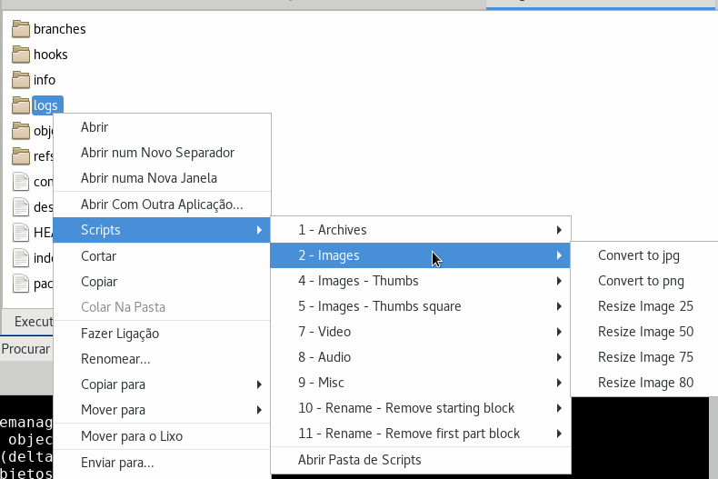

## Right-click context actions for Caja and Nautilus

This repo contains a collection of utility scripts that define context menu actions. These allow you to run a number of command-line tools by right-clicking on a file. Output is displayed in a pop-up text box. 

## Usage

I use the scripts with the caja file manager, but it can also be used with other linux file managers that support context menu scripts or it can be used as normal terminal scripts.

## Descriptions

Scripts are organised into the following categories:

* **Archives**:
    * Compress dirs - create archive from the current directories.
    * Convert to zip - convert rar and 7z archives files to zip
    * Extract all ? - extract all archives from the current directory
    * Join all splited files - join splitted files with lxjoin

* **Images**:
    * Convert to jpg - convert all images in current directory to jpg
    * Convert to png - convert all images in current directory to png
    * Resize Image ? - resizes all images in current directory to specified percentage size

* **Images - Thumbs**: 
	* Thumbs ? - creates thumbnail of all images in the directory with the specified pixel size

* **Images - Thumbs square**: 
	* Thumbs ? - creates a square thumbnail of all images in the directory with the specified pixel size

* **Video**:
    * Convert 10bit video to 8bit - convert all h264 10bit videos to h264 8bit
    * Extract ASS subs to SRT - extract all embedded ASS subtitles to srt files
    * Try to fix corrupted videos - try to generate video index for corrupted video files
* **Audio**
	* Convert flac to mp3 - convert all flac files to mp3
* **Misc**
	* Download list and compress - download all links on txt files into a folder and created a archive of that folder

* **Rename - Remove starting block**
	* Remove starting ? - Rename all files and remove all text from the start of the name of the file to the selected character.

## Installation

Make sure you have python, python-pil, imagemagick, zip, 7zip, lxsplit. For video and audio scripts install mkvtoolnix-cli, x264 and ffmpeg.

If you're using the **Caja** file manager (MATE desktop):
* copy the scripts in this repo to `~/.config/caja/scripts/` or one of its subdirectories. If 

If you're using the **Nautilus** file manager (GNOME desktop:
* copy the scripts to `~/.local/share/nautilus/scripts/`.

## Using the scripts

In Caja (or Nautilus) right-click on a file. Then select the *Scripts* item in the context menu, and navigate to the one you want to use.

## Adding new scripts

The easiest way is to copy one of the existing scripts and modify it to your needs. Note that scripts must be executable to work. You can do this with `chmod`, e.g.:

    chmod a+x newscript.sh
or

    chmod a+x newscript.py

## Disclaimer

Use at your own risk!

## More information

* [Adding Right Click context actions to Caja](http://www.ethanjoachimeldridge.info/tech-blog/caja-exifstrip-context-action)
 
